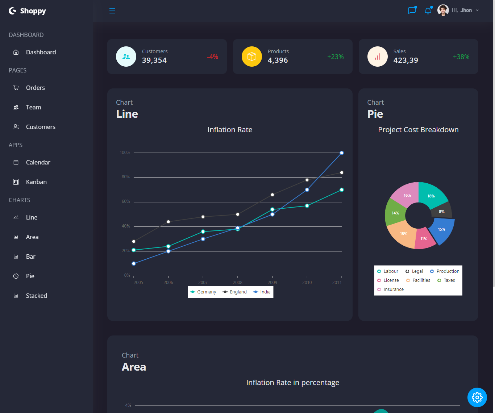

<h1 align="center">
  Shoppy
</h1>
 

 

  Shoppy is a Modern React Admin Dashboard Application with Theming, Tables, Charts, Calendar, Kanban, and More.

 
<h1 align="center">
  Tech stack
</h1>
 

  Inside the CodeTube app, I worked with the most modern, and in-demand technologies in the JavaScript ecosystem, such as React.js, TailwindCSS, syncfusion ej2, and more!
   

  
  
 A JavaScript library for building   user interfaces 

   
  
 A utility-first CSS framework packed with classes   that can be composed to build any design, directly in your markup.. 

  
  
 A utility-first CSS framework packed with classes   that can be composed to build any design, directly in your markup.. 

